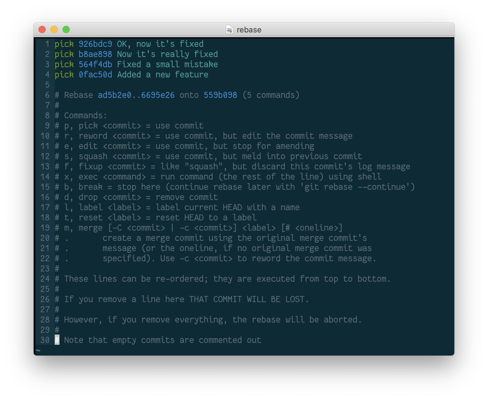

# Using interactive rebase to ensure a clean git history

{.center .large}

## The problem

Sometimes, when working on a feature branch, your commit history can get messy.
If your log looks like this:

    926bdc9 - 8 minutes ago : OK, now it's fixed
    b8ae898 - 10 minutes ago : Now it's really fixed
    564f4db - 15 minutes ago : Fixed a small mistake
    0fac50d - 20 minutes ago : Added a new feature

you should consider revising your commit history before pushing to a remote
repo. To do this, you can do an interactive
[rebase](https://git-scm.com/book/en/v2/Git-Tools-Rewriting-History). 

## Rebasing

Rebasing is a git tool for rewriting your commit history. Using `rebase`, you
can squash multiple commits together into one, resulting in a cleaner commit
history that looks like this:

    926bdc9 - 8 minutes ago : Added a new feature

To do this, run:

``` bash
git rebase -i HEAD~4
```

The `-i` flag runs the rebase interactively, and `HEAD~4` means that the rebase
will allow you to edit the last 4 commits. This command will open up an
interactive rebase vim window with the following:

    pick 926bdc9 OK, now it's fixed
    pick b8ae898 Now it's really fixed
    pick 564f4db Fixed a small mistake
    pick 0fac50d Added a new feature

    # Rebase ad5b2e0..6695e26 onto 559b098 (5 commands)
    #
    # Commands:
    # p, pick <commit> = use commit
    # r, reword <commit> = use commit, but edit the commit message
    # e, edit <commit> = use commit, but stop for amending
    # s, squash <commit> = use commit, but meld into previous commit
    # f, fixup <commit> = like "squash", but discard this commit's log message
    # x, exec <command> = run command (the rest of the line) using shell
    # b, break = stop here (continue rebase later with 'git rebase --continue')
    # d, drop <commit> = remove commit
    # l, label <label> = label current HEAD with a name
    # t, reset <label> = reset HEAD to a label
    # m, merge [-C <commit> | -c <commit>] <label> [# <oneline>]
    # .       create a merge commit using the original merge commit's
    # .       message (or the oneline, if no original merge commit was
    # .       specified). Use -c <commit> to reword the commit message.
    #
    # These lines can be re-ordered; they are executed from top to bottom.
    #
    # If you remove a line here THAT COMMIT WILL BE LOST.
    #
    # However, if you remove everything, the rebase will be aborted.
    #
    # Note that empty commits are commented out

To squash all four of these commits into one, `pick` the top commit, and
`squash` the lower three:

    pick 926bdc9 OK, now it's fixed
    squash b8ae898 Now it's really fixed
    squash 564f4db Fixed a small mistake
    squash 0fac50d Added a new feature

Then exit the rebase window with `:wq`. This will open a new vim window where
you can view and edit the commit messages of the commits you are rebasing:


    # This is a combination of 5 commits.
    # This is the 1st commit message:

    Added a new feature

    # This is the commit message #2:

    Fixed a small mistake

    # This is the commit message #3:

    Now it's really fixed

    # This is the commit message #4:

    OK, now it's fixed

    # Please enter the commit message for your changes. Lines starting
    # with '#' will be ignored, and an empty message aborts the commit.
    #
    # Date:      Sun Nov 24 22:05:15 2019 -0600
    #
    # interactive rebase in progress; onto ad5b2e0
    # Last commands done (5 commands done):
    #    squash 559b098 4
    #    squash 6695e26 5
    # No commands remaining.
    # You are currently rebasing branch 'feature/DAT-2701_cool_new_feature' on 'ad5b2e0'.
    #
    # Changes to be committed:
    #	new file:   a.txt
    #	new file:   b.txt
    #	new file:   c.txt
    #	new file:   d.txt

You can delete everything above the `#Please enter` line and rewrite a new
commit message, and then `:wq` the file.

Now your commit history is clean and you can push to the remote with a neatly
organized commit log.
